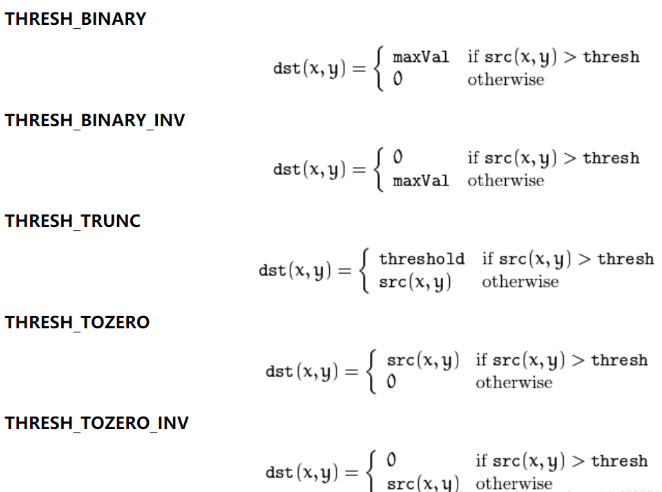

# cv

[toc]

## 1. functions

### 1. pyrDown——降低分辨率

从一个高分辨率大尺寸的图像向上构建一个金字塔（尺寸变小，分辨率降低）

```python
# cv.pyrDown(src, dst=None, dstsize=None, borderType=None)
# src：表示输入图像
# dst：表示输出图像
# dstsize：表示输出图像的大小
# borderType：表示图像边界的处理方式
img_down = cv.pyDown(img)
```

---

### 2. threshold——图像阈值

```python
# cv.threshold(src, thresh, maxval, type[, dst])
# src：表示输入图像
# thresh：表示的是阈值（起始值）
# maxval：表示的是最大值
# type：划分算法，常用值为THRESH_BINARY(maxval,0)
ret, thresh = cv.threshold(img, 127, 255, cv.THRESH_BINARY)
# ret: 127
# thresh:二值化矩阵
```




---

### 3. findContours——轮廓检测

```python
# cv.findContours(image, mode, method[, contours[, hierarchy[, offset ]]])  
# image: 输入图像
# mode: 轮廓的检索模式，RETR_EXTERNAL(外轮廓),RETR_TREE(全部轮廓)
# method:CHAIN_APPROX_SIMPLE(压缩水平方向，垂直方向，对角线方向的元素，只保留该方向的终点坐标)
image, contours, hier = cv.findContours(thresh, cv.RETR_EXTERNAL, cv.CHAIN_APPROX_SIMPLE)
# contours:存储可以用直线描述轮廓的点
# hierarchy:轮廓间的相互关系
```

---

### 4. minAreaRect——最小外接矩形

```python
rect = cv.minAreaRect(array)
# 中心坐标,宽高，旋转角度(始末连线与0°)
```

---

### 5. boxPoints——获取矩形角点

```python
box = cv.boxPoints(rect)
```

---

### 6. drawContours——绘制轮廓

```python
cv.drawContours(img, [box], 0, (0, 0, 255), 3)
# ind_2：轮廓的索引
# ind_4：线宽
```

---

### 7. minEnclosingCircle——最小外接圆

```python
 (x, y), radius = cv.minEnclosingCircle(cnt)
```

---

### 8. circle——画圆

```python
cv.Cricle(img, center, radius, (0, 255, 0), 2)
# ind_-1：线宽
```

---

### 9. rectangle——画矩形

```python
cv.rectangle(img, (x, y), (x+w, y+h), (0, 255, 0), 2)
# ind_-1：线宽
```

---

### 10. cvtcolor——转换颜色格式

```python
cv.cvtcolor(img, cv.COLOR_BGR2GRAY)
```

---

### 11. countArea——轮廓面积

```python
cv.contourArea(cnt， True)
# ind_0:单个轮廓
```

---

### 12. arcLength——轮廓周长

```python
cv.arcLength(cnt， True)
# ind_0:单个轮廓
```

---

### 13. approxPloyDP——多边形轮廓

```python
epsilon = 0.01*cv.arcLength(cnt,True)
cv.aprroxPolyDP(cnt, epsilon， True)
# ind_1：阈值，通常为轮廓周长，越小，多边形包围轮廓越紧
# ind_2：轮廓是闭合的
```

